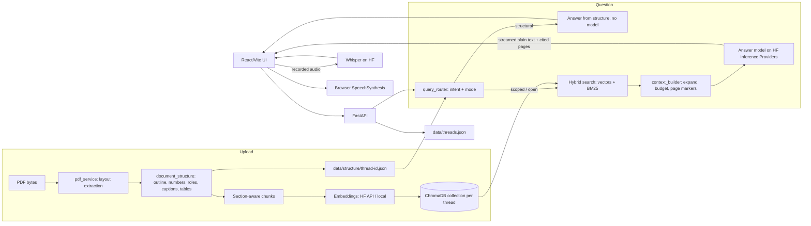

# Architecture

## Component flow

## Upload and indexing

`POST /api/threads/{id}/document` validates the PDF and runs ingestion
(`backend/ingestion.py`) in a worker thread so the API stays responsive.

1. `pdf_service.extract_document` reads every page with PyMuPDF's layout data
   (font size, bold, position). OCR is not used: pages without a text layer (scanned or
   image-only) are skipped and logged as `pages_without_text`. It:
   - normalises ligatures (NFKC) and drops rotated margin text;
   - rebuilds table rows from cells sharing a baseline (`a | b | c`, 2+ rows of 3+
     short cells outside prose blocks) - about 1 ms per page, unlike PyMuPDF's
     `find_tables` (0.3-1 s per page);
   - joins wrapped lines per text column, so two-column papers read as paragraphs;
   - removes repeated headers/footers and page numbers, and detects contents and
     list-of-figures pages (many lines ending in a page number);
   - records figure/table/box captions (not sentences such as "Figure 2 shows...")
     and tables (header row, row count).
2. The outline comes from PDF bookmarks when present, otherwise from headings set in
   a larger or bold font, otherwise from strict `Chapter N` / `N. Title` text patterns.
   Levels follow numbering depth (`2`, `2.1`, `2.1.3`) when headings are numbered,
   else font size. Front matter before an Abstract/Summary, running titles repeated on
   many pages, and contents-page entries are not sections.
3. `document_structure.build_structure` turns the outline into sections and top-level
   units. It reads labels and numbers from titles (`001. Title`, `Chapter IV`,
   `Part Two`, `Annex B`, `Article 5`, `A.1`, `Recommendation 11`), from label lines
   under them (`Story 12 of 50`), from the contents page (chapters whose number is
   printed only there) or from numbered children (`INTRODUCTION` with 1.1, 1.2 is
   chapter 1). It repairs bookmark nesting from numbering, lets `Part` headings own
   the chapters after them in flat outlines, tags section roles (summary, objectives,
   methods, results, conclusion, recommendations, limitations, definitions, budget,
   governance, monitoring, implementation), and keeps identifiers such as `AC-2`,
   common `Key: value` fields, captions and tables.
4. `chunk_document` splits each section separately (1,000 characters, 150 overlap,
   paragraph/sentence boundaries), so no chunk mixes two sections. Each chunk keeps
   page, character offsets, section, unit, section path and - when it starts inside
   a table - the table's header row.
5. Chunks are embedded with the section path (and table header) prepended and written
   to the thread's Chroma collection. The structure is saved as
   `data/structure/<thread_id>.json`.

## Search index

`vector_store.ThreadVectorStore` keeps, per thread, the Chroma collection on disk and
an in-memory index loaded from it: a normalised embeddings matrix (NumPy), BM25
postings, and lookups by section, unit and page. The eight most recently used
threads stay in memory.

Embeddings come from one of three backends (`EMBEDDING_BACKEND`):

| Backend | Document embeddings | Question embeddings |
|---|---|---|
| `hf` | HF API, parallel batches | HF API |
| `hybrid` | HF API, parallel batches | local `sentence-transformers` (no network round-trip) |
| `local` | local | local |

Local models (and the optional reranker) are warmed up in a background thread when
the server starts. Question embeddings are cached, and the parts of a multi-part
question are embedded in a single request.

## Query and answer

`query_router.route_query` classifies each question against the saved structure:

| Intent | Example | Answered by |
|---|---|---|
| count | how many chapters / annexes / recommendations / pages / headings / tables; how many sub-sections in 2.1; topics with Domain X | structure, no model |
| list | table of contents, list annexes, chapters 1-20, sections in chapter 2, all figures | structure, no model |
| lookup | title of topic 2, name of the 20th story | structure, no model |
| locate | which section discusses X, where is X mentioned, on which page | search hits grouped by section, ranked by evidence, one quoted sentence each, no model |
| explain | explain chapter 10 / Annex B / section 3.2.4 / AC-2, summarize topics 1-20 | the section's text (budgeted); long sections via per-sub-section summaries; ranges per chapter in parallel; summaries cached |
| compare | compare topic 3 and 7 / two section titles | each section's text |
| scoped_qa | what does chapter 4 say about X; a question naming a section title | that section's text plus its sub-section outline, searched inside if large, plus strong evidence from elsewhere |
| caption | what does Table 2 / Figure 3 show | caption page (and the next page when the caption ends a page) |
| page | what is on page 45 | those pages |
| overview | what does the document contain | abstract/executive summary, outline, field counts, each chapter's opening (cached) |
| qa | anything else | hybrid retrieval with a mode (below) |

Open questions get a mode that sets retrieval breadth, prompt and model:

| Mode | Example | Handling |
|---|---|---|
| direct | what is the reporting deadline? | top hits expanded to section/neighbours |
| multi | who is eligible and how is funding allocated? / objectives, budget and timeline of X | each part searched separately, evidence interleaved, answered part by part |
| compare | difference between a baseline and an overlay | each side searched separately; passages assigned to the side that ranks them higher; evidence shown per side |
| analysis | why / implications / strengths and weaknesses | wider context; inferences must be marked and tied to cited pages |
| enumerate | what are the principles / list all requirements | slightly wider context; complete list, only directly relevant items |
| ambiguous | "sandboxes" | each distinct use covered with its section |

Questions about findings, recommendations, objectives, methods, limitations, budget,
governance, monitoring or implementation also receive the sections with that role.
Content nouns such as "recommendation" or "objective" are treated as structure only
when the PDF labels headings with them; otherwise the question goes to retrieval.

Hybrid retrieval scores every chunk by cosine similarity and BM25, fuses the two
rankings with reciprocal-rank fusion (optionally re-scored by a local cross-encoder),
and expands the top hits into context: the whole section when it fits, otherwise the
neighbouring chunks. Overlaps are removed, table headers are restored for excerpts
that start mid-table, excerpts are ordered by relevance, and page markers are kept.
If the best hit has cosine similarity below `RETRIEVAL_MIN_SIMILARITY` and matches
fewer than half the question's keywords, the service abstains without calling a model.

## Models and providers

`chat_service.ChatService` creates one Hugging Face `InferenceClient` per provider:

- `HF_CHAT_MODEL` on `HF_PROVIDER` writes every answer by default.
- `HF_ANALYSIS_MODEL` on `HF_ANALYSIS_PROVIDER`, when set, handles the multi,
  compare, analysis, enumerate and ambiguous modes.
- Embeddings use `EMBEDDING_MODEL` on `HF_EMBEDDING_PROVIDER` (or locally).
- Speech-to-text uses `HF_ASR_MODEL` at `HF_ASR_URL`.

Quota (HTTP 402) and rate-limit (429) errors are reported to the user as clear messages.

## Grounding

Answer length follows the question: `brief` ("briefly", "in 5 points"), `normal`
(default: only as long as needed, usually 60-250 words) or `detailed` ("in detail",
"comprehensive"). Each level sets the prompt's length instruction and the output-token
limit. "What is chapter X about?" returns the chapter's exact sub-section list from the
outline plus one concise explanation; "explain chapter X in detail" on a long chapter
streams one summary per sub-section. Comparisons show each item's evidence, passages
that mention the items together in a comparison table (Aspect rows, one column per
item), and must not invent similarities or add a judgement. Other answers use a table
when several items share the same attributes.
A repetition guard stops generation if the model starts repeating lines or writing
"(continued)" headings.

Prompts require precise, PDF-only answers, `[Page N]` citations restricted to the
pages supplied, exact figures and obligation words (must/shall/should/may),
row-by-row checks for table maximums and totals, and the fixed reply
"I couldn't find that in the uploaded PDF." when the text does not contain the answer.
Model output is streamed through a plain-text filter (markdown bold/headings removed).
Follow-up questions inherit the previously referenced section; recent history
(skipping not-found turns) is used only to resolve references. The sources returned
are limited to the pages the answer cites.

## Voice

The browser records audio and sends it to `/transcribe`. Whisper returns text, which
is submitted to the normal chat flow. Answer playback uses browser `SpeechSynthesis`
from the `Listen` button.

## Storage and thread isolation

| Data | Location |
|---|---|
| Threads and messages | `data/threads.json` (re-read only when the file changes) |
| Uploaded PDFs | `data/documents/<thread_id>.pdf` |
| Search index | `data/chroma`, collection `thread_<thread_id_without_hyphens>` |
| Structure | `data/structure/<thread_id>.json` |
| Cached summaries and overview | `data/structure/<thread_id>.digests.json` |

`ThreadStore` assigns each thread a UUID and every path above derives from it.
Retrieval receives the active thread ID and never searches other collections. Saving
a message re-reads the thread first, so concurrent requests do not overwrite each
other. Deleting a thread removes its collection, structure, summaries, PDF and
metadata. When the stored index or structure was built by an older version, the
thread is re-indexed from its saved PDF on the next question.

## Performance logs

`[PERF]` lines in the backend output measure each step:

- Upload: `file_upload_seconds`, `pdf_extraction_seconds` (with outline source,
  outline entries and captions), `pages_processed`, `chunking_seconds`,
  `chunks_created`, `embedding_generation_seconds`, `embedding_indexing_seconds`,
  `total_document_ingestion_seconds`.
- Question: `route` (intent, target, mode), `query_embedding_seconds`,
  `batch_query_embedding_seconds`, `reranker_seconds`, `retrieval_seconds`,
  `abstained`, `planning_seconds`, `llm_generation_seconds`, `repetition_stopped`, `hierarchical_explain_seconds`,
  `llm_completion_seconds`, `multi_unit_generation_seconds`,
  `chat_stream_endpoint_total_seconds`.
- Other: `legacy_reindex_seconds`, `local_model_warmup_seconds`.

Tests use fake models, so their timings do not represent real model latency.

## Modules

| File | Responsibility |
|---|---|
| `backend/main.py` | API routes, upload in a worker thread, streaming, model warm-up |
| `backend/config.py` | Settings from `.env` |
| `backend/ingestion.py` | Extract → structure → chunk → index |
| `backend/pdf_service.py` | Layout extraction, tables, captions, contents pages, outline detection, chunking |
| `backend/document_structure.py` | Sections, units, numbering, labels, roles, fields, captions, tables |
| `backend/vector_store.py` | Embeddings (API / local / hybrid), Chroma storage, in-memory hybrid search, optional reranker, cached summaries |
| `backend/query_router.py` | Intent and mode routing, references, sub-questions, comparison sides |
| `backend/context_builder.py` | Context expansion, budgets, excerpts, quotes, sources |
| `backend/chat_service.py` | Structural answers, prompts, model clients, streaming and parallel model calls |
| `backend/speech_service.py` | Whisper request |
| `backend/thread_store.py` | JSON thread persistence |
| `backend/models.py`, `backend/errors.py` | API data models and errors |
| `frontend/src/App.jsx` | Threads, upload, streamed chat (markdown tables rendered as tables), voice and Listen |
| `frontend/src/styles.css` | Layout and processing indicator |

## Current limitations

- ChromaDB is the only vector store backend.
- Answer models run on Hugging Face Inference Providers and consume account credits.
- Images and charts are not interpreted; only captions and surrounding text are used.
- No OCR: scanned or image-only pages are not indexed.
- JSON thread storage is for local single-user use.
- The test suite does not call real Hugging Face services or run a browser flow.
