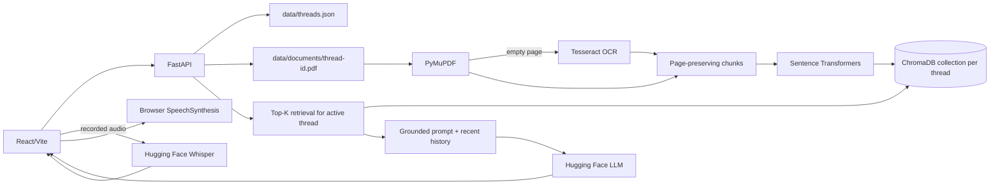

# Architecture

## Component flow

## Upload and indexing

`POST /api/threads/{id}/document` validates the PDF, extracts text page by page,
uses Tesseract only for pages without extracted text, and splits text into
1,200-character chunks with 200-character overlap. Each chunk keeps its page
number. Sentence Transformers embeds the chunks and ChromaDB stores them.

The frontend displays `Processing...` and a spinner until this request completes.
The upload control is disabled during processing. Success displays the processed
document; failure displays an error and allows retry.

## Query and answer

For a chat request, `backend/vector_store.py` embeds the question and retrieves
the top five chunks from the active thread's Chroma collection. `backend/chat_service.py`
combines those page-tagged excerpts with the latest eight messages and sends them
to the configured Hugging Face model. The response includes the answer and source
excerpts. The prompt requires page citations and a fixed not-found response when
the excerpts do not contain the answer.

## Voice

The browser records audio and sends it to `/transcribe`. The configured Hugging
Face Whisper endpoint returns text, which is submitted to the normal chat flow.
Answer playback uses browser `SpeechSynthesis` from the `Listen` button.

## Thread isolation

`ThreadStore` assigns each thread a UUID. The PDF path and Chroma collection are
both derived from that UUID. Retrieval receives the active thread ID and does not
search other collections. Thread deletion removes the collection, PDF, and JSON
metadata.

## Storage and modules

- `backend/main.py`: API routes and request flow
- `backend/pdf_service.py`: extraction and chunking
- `backend/ocr_service.py`: Tesseract fallback
- `backend/vector_store.py`: embeddings, Chroma storage, retrieval, deletion
- `backend/chat_service.py`: retrieval context, history, and LLM call
- `backend/speech_service.py`: Whisper request
- `backend/thread_store.py`: JSON thread persistence
- `frontend/src/App.jsx`: threads, upload, chat, voice, and TTS
- `frontend/src/styles.css`: layout and processing indicator

## Configuration

Model names, Hugging Face settings, chunk size, overlap, top-K, temperature,
maximum upload size, and storage paths are read by `backend/config.py` from `.env`.
ChromaDB is the current vector backend and its persistence directory is configurable.

## Current limitations

- The backend currently uses ChromaDB only.
- OCR requires the external Tesseract executable.
- JSON storage is for local single-user use.
- The test suite does not call real Hugging Face services or run a browser flow.
